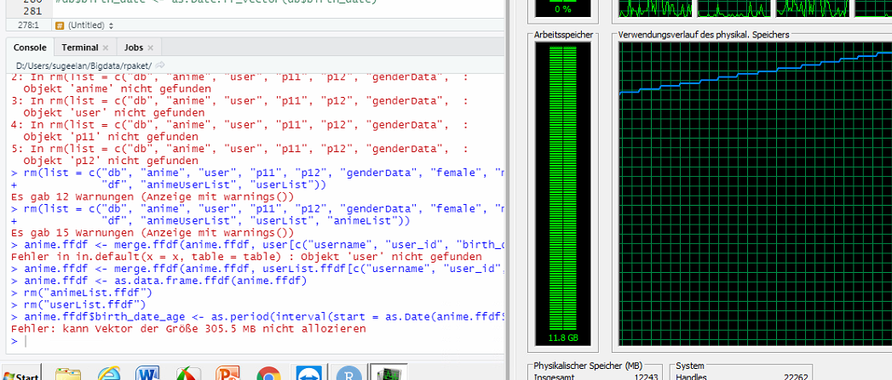
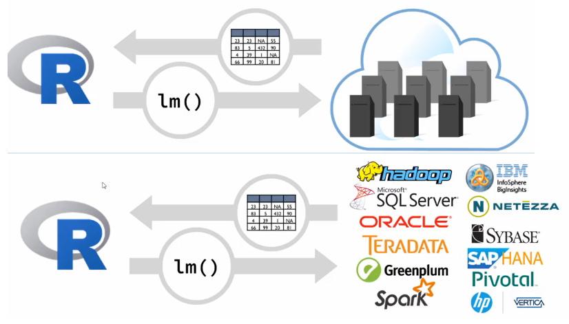
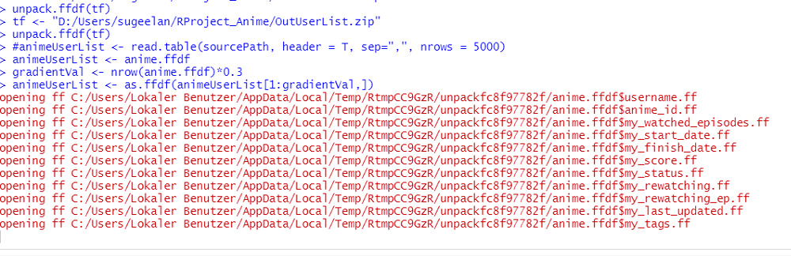

```{r setup, include=FALSE}
knitr::opts_chunk$set(echo = FALSE)
```

## Test


```{r}

```

## Inhalt

- Was ist Big Data?
- Big Data in R
- ff Paket
- Anime Daten
- Vorgehen
- Code

## Was ist Big Data?

"Big data" is high-volume, -velocity and -variety information assets that demand cost-effective, innovative forms of information processing for enhanced insight and decision making.

https://www.gartner.com/en/information-technology/glossary/big-data
https://www.sas.com/de_ch/insights/big-data/what-is-big-data.html


## Big Data in R
- Data > RAM
- Dataset > 2 GB wird schwierig
- int64 Datentyp gibt es nicht
  - (2^31 -1) --> max. 2'147'483'647 Indexierung möglich
- Daumenregel: RAM 2-3x > Datasetgrösse


## Big Data in R
- Probleme
  - RAM/OS Limitierung
  - Lange Bearbeitungszeit
- Lösung
  - Mehr RAM / Teilen & herrschen
  - Parallelität
  
## Big Data in R
- (<2 GB)
  - Lade bestimmte Spalten/Zeilen
- (2-10 GB)
  - bigmemory, ff
- (10 GB >)
  - hadoop, Spark, ..
  - https://rstudio.com/resources/webinars/working-with-big-data-in-r/
  
## Big Data in R > 10GB mit dplyr

  
1. Connects: Verbindung zur Datenbank (z.B RJDBC)
2. Transform: R in SQL
3. Run: SQL ins DBMS (Datawarehouse) schicken und ausführen
4. Collect: Ergebnis in R (lazy execution)


## ff Paket
- hilft beim Überwinden des RAM-Problems
- Universität Göttingen
- Daten werden aufgeteilt


http://citeseerx.ist.psu.edu/viewdoc/download?doi=10.1.1.487.1317&rep=rep1&type=pdf
  
  

## Anime Daten
- Daten über Zuschauer von Anime
- 9GB gross


## Vorgehen
1. ff Package testen
2. Problemgrösse verkleinern (5000 zeiliger Sample)
3. Statistische Modelle vorbereiten
4. Modelle auf Bigdata Datensatz anwenden


## ff Vorbereitung
```{r echo=TRUE}
# RAM grösse
memory.limit()

## ff Vorbereiten
sourcePath <- "D:/Users/sugeelan/RProject_Anime/myanimelist/UserAnimeList.csv"
tempPath <- "D:/Users/sugeelan/RProject_Anime/TEMP"
outZIP <- "D:/Users/sugeelan/RProject_Anime/Out1"

## Check Temp path
getOption("fftempdir")
tempfile()

## set Temp path
#options("fftempdir" = tempPath)

```


## ff Daten speichern

```{r echo=TRUE}
############################################ SAVE DATA in Tempfolder
# anime.ffdf <- read.csv.ffdf(file=sourcePath)

# outPath <- outZIP # D:/Users/sugeelan/RProject_Anime/Out1
# td <- outPath
# tmpFile <- outPath

##### save the ffdf into the supplied directory
# save.ffdf(anime.ffdf, dir=td) # Ausgabeordner (targetdirectory) ohne .zip

##### remove the ffdf from memory
# rm("anime.ffdf")

##### and reload the stored ffdf
# load.ffdf(dir=td)

# tf <- paste(tmpFile, ".zip", sep="")
# packed <- pack.ffdf(file=tf, anime.ffdf) # 30 Min. in Zip verpacken

##### remove the ffdf from memory
# rm("anime.ffdf")

```

## ff Daten laden

```{r echo=TRUE}
######################################## Load Data from Zip file
# restore the ffdf from the packed ffdf
# unter TF ish "D:/Users/sugeelan/RProject_Anime/Out1.zip"
# tf <- "D:/Users/sugeelan/RProject_Anime/Out1.zip"
# unpack.ffdf(tf)

```


## run
- 30 % der Daten verarbeiten

```{r eval=TRUE}
library(ff)
library(ffbase)
library(lubridate)
library(datasets)
library(ggplot2)
library(plotrix)
library(dplyr)

#install.packages("devtools")
#devtools::install_github("edwindj/ffbase2")
library(ffbase2)

## ff Vorbereiten
sourcePath <- "D:/Users/sugeelan/RProject_Anime/myanimelist/UserAnimeList.csv"
tempPath <- "D:/Users/sugeelan/RProject_Anime/TEMP"

outZIP <- "D:/Users/sugeelan/RProject_Anime/Out1"
#tempPath <- tempfile()

## Check Temp path
getOption("fftempdir")

## set Temp path
options("fftempdir" = tempPath)

## Check Temp path again
getOption("fftempdir")


# restore the ffdf from the packed ffdf
# unter TF ish "D:/Users/sugeelan/RProject_Anime/Out1.zip"
tf <- "D:/Users/sugeelan/RProject_Anime/Out1.zip"
unpack.ffdf(tf)

tf <- "D:/Users/sugeelan/RProject_Anime/OutAnimeList.zip"
unpack.ffdf(tf)

tf <- "D:/Users/sugeelan/RProject_Anime/OutUserList.zip"
unpack.ffdf(tf)


#animeUserList <- read.table(sourcePath, header = T, sep=",", nrows = 5000)
animeUserList <- anime.ffdf
gradientVal <- nrow(anime.ffdf)*0.3
animeUserList <- as.ffdf(animeUserList[1:gradientVal,])


```

## Untersuchung vom Datensatz

```{r eval=TRUE}
str(anime.ffdf)


```

## Untersuchung vom Datensatz

```{r eval=TRUE}
dim(anime.ffdf)

```

## Untersuchung vom Datensatz

```{r eval=TRUE}
dim(anime.ffdf)

names(animeUserList)

```

## Plots

```{r echo=FALSE}

#Anime Liste laden
csvAnimeList <- "AnimeList.csv"
#animeList <- read.csv(file = csvAnimeList, header = T, sep = ",")
animeList <- animeList.ffdf


# Userlist laden
csvUserList <- "UserList.csv"
#userList <- read.csv(file = csvUserList, header = T, sep = ",")
userList <- userList.ffdf


##############################################
##############################################
########## Anime XYZ wir von welcher##########
########## Altersklasse angeschaut  ##########
##############################################
##############################################
##############################################


db <- animeUserList


anime <- animeList


user <- userList


db <- merge.ffdf(db, user[c("username", "user_id", "birth_date", "gender")], by = "username")

user <- as.data.frame.ffdf(user)
anime <- as.data.frame.ffdf(anime)
db <- as.data.frame.ffdf(db)


db$birth_date_age <- as.period(interval(start = as.Date(db$birth_date), end = "2020-06-05"), unit = "days")@day/365


#db[db$anime_id == 120,]
unique(db$gender)
db$gender <- factor(db$gender, labels = c("Uknown", "Female", "Male", "Non-Binary"))
p11 <- ggplot(db[db$anime_id == 120,], aes(x = gender, y = birth_date_age)) + geom_boxplot()
p11

```


## plot 2

```{r echo=FALSE}

####
library(RColorBrewer)

#View(anime)

animeID_member <- anime$anime_id[anime$members == max(anime$members)][1] #max(anime$members) 730076
animeID_rank <- as.integer(table(anime$anime_id[anime$rank == 1]))[1]
animeID_popularity <- anime$anime_id[anime$popularity == 10][1]

db <- merge(db, anime[c("anime_id", "title")], by = "anime_id")


#db$anime_id == animeID_member

#db$anime_id == animeID_member 

#tmp <- db[db$anime_id == animeID_member[1], ]


serie_trimmed <- db[which(db$anime_id == animeID_member |
                            db$anime_id == animeID_rank |
                            db$anime_id == animeID_popularity),]
#serie_trimmed$gender.f <- factor(db$gender, labels = c("Uknown", "Female", "Male"))
serie_trimmed$gender.f <- serie_trimmed$gender


p12 <- ggplot(serie_trimmed, aes(x = title, y = birth_date_age, fill = gender.f)) +
  geom_boxplot(alpha = 0.7) +
  scale_y_continuous(name = "Altersverteilung",
                     breaks = seq(18, 36, 6),
                     limits = c(18, 36)) +
  scale_x_discrete(name = "Anime ID") +
  ggtitle("Boxplots für Animes") +
  theme_bw() +
  theme(plot.title = element_text(size = 14, family = "Tahoma", face = "bold"),
        text = element_text(size = 12, family = "Tahoma"),
        axis.title = element_text(face = "bold"),
        axis.text.x = element_text(size = 11)) +
  scale_fill_brewer(palette = "Accent")
p12

```

## Plot 3

```{r echo=FALSE}

db <- animeUserList # unser big data
anime <- animeList
user <- userList


mergedAnime <- merge(db, anime)
mergedAnime <- as.data.frame.ffdf(mergedAnime)


# drop useless rows


cleanedAnime <- mergedAnime %>%
  select(-my_tags, -image_url, -title_japanese, -title_synonyms, -background, -broadcast, -related, -opening_theme, -ending_theme)


#View(mergedAnime)


##############################################
########## mean Score per Anime Type #########
##############################################


# schauen welche Anime Typen es gibt
#unique(cleanedAnime$type)


# Scores vorbereiten für Movie, Music, ONA, OVA, Special, TV, Unknown
scoreMovie <- subset(cleanedAnime$score, cleanedAnime$type == "Movie")
scoreMusic <- subset(cleanedAnime$score, cleanedAnime$type == "Music")
scoreONA <- subset(cleanedAnime$score, cleanedAnime$type == "ONA")
scoreOVA <- subset(cleanedAnime$score, cleanedAnime$type == "OVA")
scoreSpecial <- subset(cleanedAnime$score, cleanedAnime$type == "Special")
scoreTV <- subset(cleanedAnime$score, cleanedAnime$type == "TV")
scoreUnknown <- subset(cleanedAnime$score, cleanedAnime$type == "Unknown")


# Averages berechnen
avgScore <- c(mean(scoreMovie), mean(scoreMusic), mean(scoreONA), mean(scoreOVA), mean(scoreSpecial), mean(scoreTV)) 


# data frame aus average scores und types erstellen
df <- data.frame(avgScore, types = c("Movie","Music","ONA","OVA","Special","TV", "Unknown"))


# plot erstellen
ggplot(df, aes(x = types, y = avgScore)) +
  geom_bar(stat = "identity", fill = "blue")


```


## Plot 4

```{r echo=FALSE}


#########################
##### Gender Analyse ####
#########################


# Daten anschauen

user$user_days_spent_watching

user <- as.data.frame.ffdf(user)

# Dataframe mit Gender und user_days_spent_watching
genderData <- user %>%
  select(gender, user_days_spent_watching)

genderData <- user %>%
  select(gender, user_days_spent_watching)


#str.ff(unique(db$username))


# nach Frauen und Männern auftrennen
female <- filter(genderData, genderData$gender == "Female")
male <- filter(genderData, genderData$gender == "Male")


# Average
avgDaysSpentWatching <- c(mean(female$user_days_spent_watching), mean(male$user_days_spent_watching))


# data frame erstellen
dfGender <- data.frame(avgDaysSpentWatching, gender = c("Female", "Male"))


# Plot erstellen
pie(avgDaysSpentWatching, labels = dfGender$gender, main = "Schauen Männer oder Frauen mehr Anime?")


```


## Plot 5

```{r echo=FALSE}

pie3D(avgDaysSpentWatching, labels = dfGender$gender, main = "Schauen Männer oder Frauen mehr Anime?")
```


## Probleme
- RAM / Speicher > Tempfolder wird nicht gewechselt
- 5000 Zeilen laden
- ffdf.data.frame
- data.frame.ffdf
- Rtools -> ZIP Probleme
- Wenig Speicher auf der Festplatte

## Probleme
- Kaeggle Notepad: 12 GB RAM, 4 GB Disk
- Colab Notepad: 12 GB RAM, 120 GB Disk
- R-Studio Cloud: 1 GB RAM, 1 CPU


## gc()


## Slide with R Output

```{r cars, echo = TRUE}
summary(cars)
```

## Slide with Plot

```{r pressure}
plot(pressure)
```

